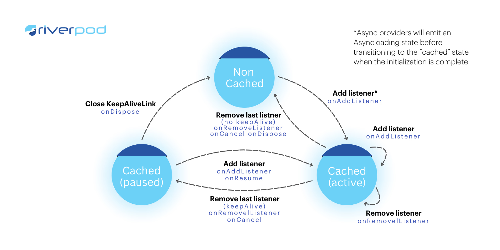
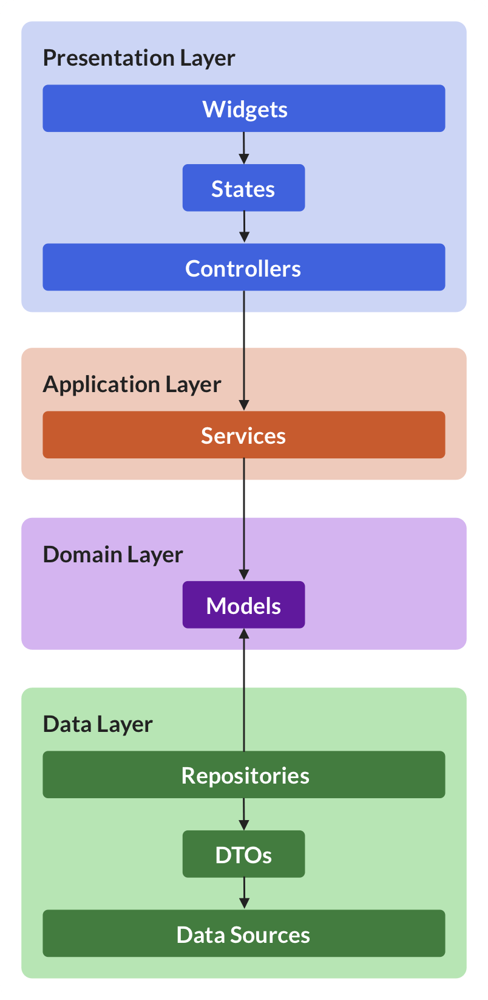

```bash
lib/
├── main.dart
│
├── app/
│   └── app.dart
│
├── core/
│   └── services/
│       └── api_service.dart
│
├── features/
│   └── counter/
│       ├── providers/          ← 👈 PROVIDER OF STATE
│       │   └── counter_provider.dart
│       │
│       ├── screens/
│       │   └── counter_screen.dart
│       │
│       └── widgets/
│
└── shared/
    └── widgets/
<!-- Next -->

lib/
│
├── main.dart
│
├── app/
│   ├── app.dart
│   └── app_providers.dart
│
├── core/
│   ├── models/
│   │   └── user_model.dart
│   │
│   ├── services/
│   │   └── api_service.dart
│   │
│   └── utils/
│       └── constants.dart
│
├── features/
│   └── auth/
│       ├── provider/
│       │   └── auth_provider.dart
│       │
│       ├── screens/
│       │   └── login_screen.dart
│       │
│       └── widgets/
│           └── login_form.dart
│
└── shared/
    ├── widgets/
    │   └── app_button.dart
    │
    └── providers/
        └── theme_provider.dartlib/

<!-- Next -->
│
├── main.dart
│
├── app/
│   ├── app.dart
│   └── app_providers.dart
│
├── core/
│   ├── models/
│   │   └── user_model.dart
│   │
│   ├── services/
│   │   └── api_service.dart
│   │
│   └── utils/
│       └── constants.dart
│
├── features/
│   └── auth/
│       ├── provider/
│       │   └── auth_provider.dart
│       │
│       ├── screens/
│       │   └── login_screen.dart
│       │
│       └── widgets/
│           └── login_form.dart
│
└── shared/
    ├── widgets/
    │   └── app_button.dart
    │
    └── providers/
        └── theme_provider.dart

